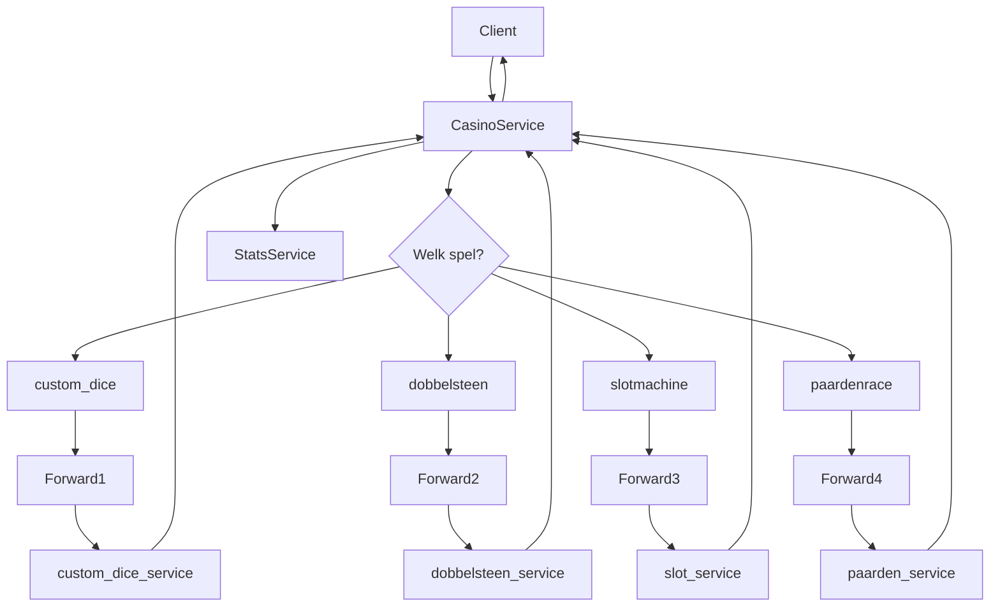
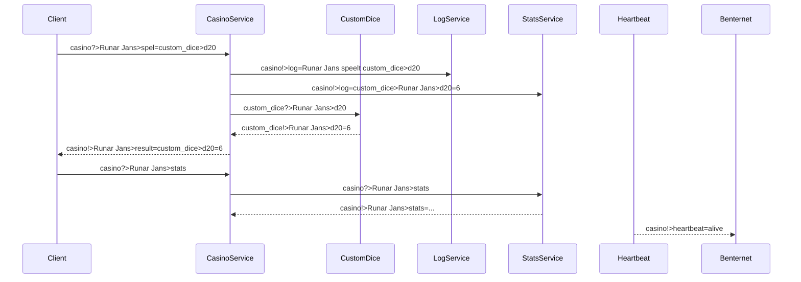

# 🎰 Benternet Casino Service — Project van Runar Jans


## 🎯 Over het project

Dit project is een modulaire en uitbreidbare casino-service gebouwd op het Benternet-netwerk. De service biedt meerdere minigames aan zoals:

- 🎲 Dobbelsteen
- 🧠 Custom Dice (zoals d4, d20, d1000, …)
- 🏇 Paardenrace
- 🎰 Slotmachine

Naast spelinteractie zijn er ook ondersteunende modules:

- 💓 Heartbeat-service (alive-check)
- 🪵 Logservice (voor monitoring en debugging)
- 📈 Stats-service (voor gebruikersstatistieken en winstpercentages)

De gebruiker heeft slechts één universele client nodig, die met één commando elk spel kan aanspreken via de centrale CasinoService.

## 💡 Communicatiestructuur

Client → CasinoService → Subservices  
Subservices → CasinoService → Client

Alle communicatie gebeurt volgens het Benternet-patroon:

- Aansturen via: topic?>
- Antwoorden via: topic!>

## 🕹️ Spellen en syntax

Gebruik steeds:

```bash
client.exe casino "Jouw Naam" "spel=<spelcode>"
```

Voorbeelden:

- 🎲 Custom Dice: `client.exe casino "Runar Jans" "spel=custom_dice>d20"`
- 🎲 Dobbelsteen: `client.exe casino "Runar Jans" "spel=dobbelsteen"`
- 🏇 Paardenrace: `client.exe casino "Runar Jans" "spel=paarden"`
- 🎰 Slotmachine: `client.exe casino "Runar Jans" "spel=slot"`
- 📊 Bekijk stats: `client.exe casino "Runar Jans" "stats"`

## 🧠 Logica flowchart (vereenvoudigd)



## 📬 Communication Sequence Diagram



## ⚙️ Getting Started

1. Clone de repo

```bash
git clone https://github.com/RunarJans/BenternetCasino.git
cd BenternetCasino
```

2. Compileer de services:

```bash
g++ casino_service.cpp -o casino.exe -lzmq
g++ casino_log_service.cpp -o casino_log.exe -lzmq
g++ casino_heartbeat_service.cpp -o casino_heartbeat.exe -lzmq
g++ casino_stats_service.cpp -o casino_stats.exe -lzmq
g++ custom_dice_service.cpp -o custom_dice_service.exe -lzmq
g++ dobbelsteen_service.cpp -o dobbelsteen_service.exe -lzmq
g++ paarden_service.cpp -o paarden_service.exe -lzmq
g++ slot_service.cpp -o slot_service.exe -lzmq
```

3. Start de services:

```bash
./casino.exe
./custom_dice_service.exe
./dobbelsteen_service.exe
./paarden_service.exe
./slot_service.exe
./casino_log.exe
./casino_heartbeat.exe
./casino_stats.exe
```

4. Start je client (of geef deze aan je gebruikers)

```bash
client.exe casino "Naam" "spel=custom_dice>d6"
client.exe casino "Naam" "stats"
```

## 📈 Beoordelingspunten & status

| Criterium       | Score | Opmerkingen |
|-----------------|-------|-------------|
| ✅ C++ & OOP     | 5/5   | Modulaire structuur, moderne technieken, foutafhandeling, duidelijke inputvalidatie |
| ✅ Benternet     | 1/1   | PUSH, PUB/SUB, forwarding, correcte topicstructuur |
| ✅ Autonomie     | 5/5   | Elke gebruiker heeft unieke communicatiekanalen + statetracking |
| ✅ Diensten      | 4/4   | Dobbelsteen, custom_dice, paardenrace, slotmachine, stats, foutmeldingen |
| ✅ Reacties      | 4/4   | Logservice, heartbeat, stats queries, naam-specifieke replies |
| ✅ GitHub        | 1/1   | Duidelijke README, projectstructuur, klaar voor CI/CD |

🎯 Totaalscore: 20/20

## 👨‍💻 Auteur

- Runar Jans  
- GitHub: https://github.com/RunarJans