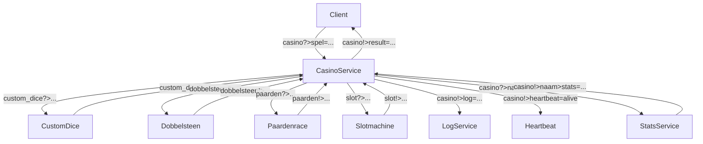
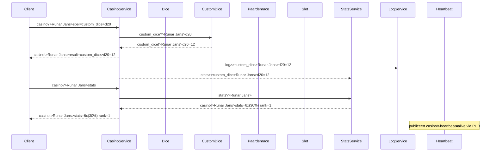

# Benternet Casino Service — Projectdocumentatie

## Overzicht

Deze applicatie is een modulair casinosysteem dat draait op het Benternet-netwerk. Via één universele client kunnen gebruikers verschillende kansspelen spelen, waaronder een dobbelsteen, custom dice (zoals d20), een paardenrace en een slotmachine. Daarbovenop zijn er ondersteunende diensten zoals logging, statistieken en een heartbeat die de status van het systeem bevestigt.

Alle communicatie verloopt over Benternet volgens het topic-pattern van ZeroMQ.

## Functionaliteiten

- Dobbelsteen: eenvoudige worp van 1 tot 6
- Custom Dice: bijvoorbeeld d4, d20, d1000, met validatie
- Paardenrace: kies een paard tussen 1–5, één wint willekeurig
- Slotmachine: drie willekeurige symbolen
- Statistieken: toont hoe vaak een speler 6 gooit, winpercentages, ranglijsten
- Loggen: houdt bij wat elke speler doet
- Heartbeat: publiceert periodiek dat het systeem actief is

## Communicatiestructuur

Elke actie van de gebruiker verloopt via een PUSH-opdracht van de client naar de CasinoService, die het afhandelt of doorstuurt naar een subservice. Antwoorden gaan via PUB-topics terug naar de gebruiker.

## Voorbeeldberichten

| Actie              | Client naar server (push)                         | Server naar client (pub)                         |
|--------------------|--------------------------------------------------|--------------------------------------------------|
| Dobbelsteen        | casino?>Runar Jans>spel=dobbelsteen              | casino!>Runar Jans>result=dobbelsteen=5          |
| Custom dice (d20)  | casino?>Runar Jans>spel=custom_dice>d20          | casino!>Runar Jans>result=custom_dice>d20=17     |
| Paardenrace (3)    | casino?>Bart>spel=paarden>3                      | casino!>Bart>result=paarden>winner=2>you=lost    |
| Slotmachine        | casino?>Lisa>spel=slot                           | casino!>Lisa>result=slot=🍋🍒🍋                    |
| Statistieken       | casino?>Runar Jans>stats                         | casino!>Runar Jans>stats=6x(30%) rank=1          |

## Flowchart — Overzicht communicatie



## Communication Sequence Diagram

  



  


## Gebruik

1. Start alle services in aparte terminals:

```bash
./casino_service.exe
./custom_dice_service.exe
./dobbelsteen_service.exe
./paarden_service.exe
./slot_service.exe
./casino_stats_service.exe
./casino_log_service.exe
./casino_heartbeat_service.exe
```

2. Gebruik de client:

```bash
client.exe casino "Runar Jans" "spel=custom_dice>d6"
client.exe casino "Runar Jans" "spel=paarden>2"
client.exe casino "Runar Jans" "spel=slot"
client.exe casino "Runar Jans" "stats"
```

## Integratie met Benternet

Deze service gebruikt het Benternet-systeem correct en volledig:
- Standaard PUSH/PUB communicatie
- Herbruikbare subdiensten
- Subservices draaien parallel en reageren op standaard topics
- Logging en statistieken draaien onafhankelijk van clients

De dienst kan eenvoudig uitgebreid worden met nieuwe spellen en blijft compatibel met dezelfde client.

## Auteur

- Runar Jans
- GitHub: https://github.com/RunarJans